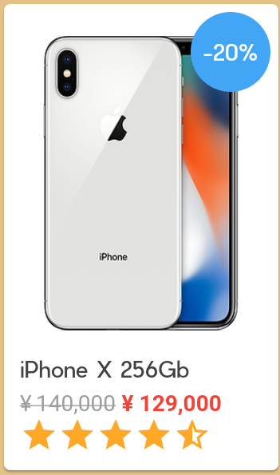
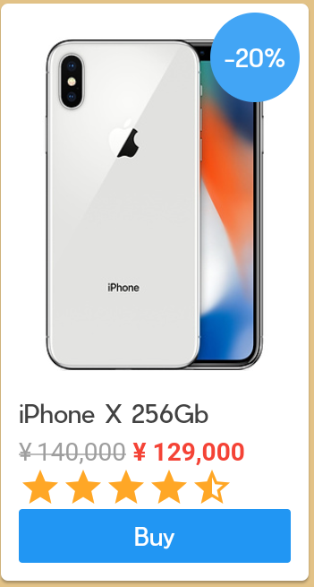
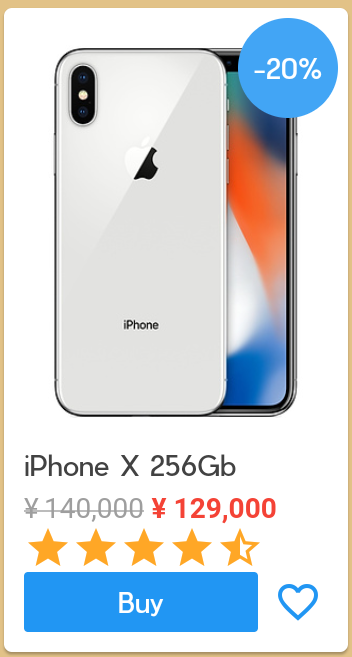
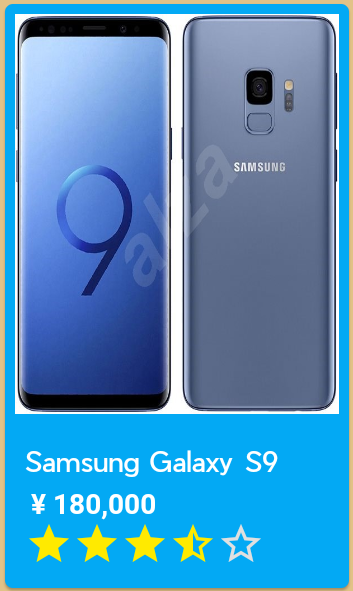
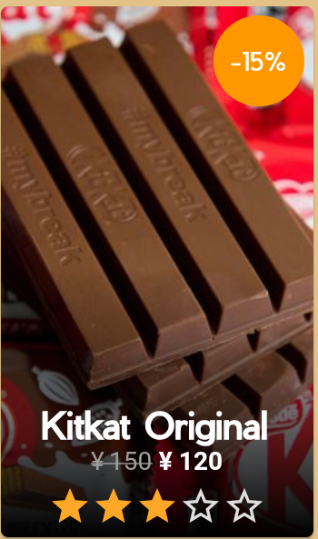
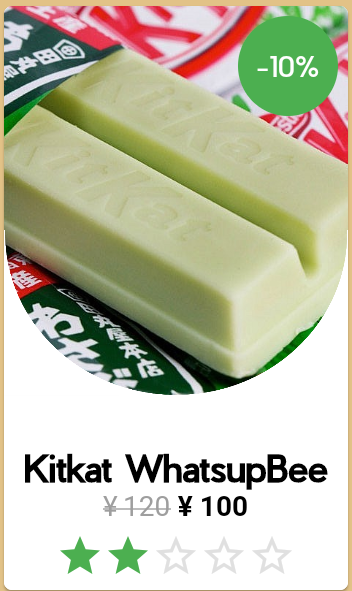

# Flutter Shop Item Builder Kit

These components make you easier to build a shop card items.
You don't need to build from scratch about gridview with DYNAMIC height.

## Screenshots And Usage


I make 3 different card that you can use easily, `easyShopCard`, `shadowShopCard`, and `circleShopCard`.
And put everything in 1 builder called `shopBuilder`.

```
body: SingleChildScrollView(
 child: ShopBuilder(
  height: 300.0,
  column: 2,
  children: <Widget>[
  new EasyShopCard(
    image: NetworkImage(''),
    itemName: 'iPhone X 256Gb',
    prePrice: '¥ 140,000',
    price: '¥ 129,000',
    rating: 4.5,
    badge: '-20%',
    badgeBgColor: Colors.blue[400],
    height: 300.0,
    imageHeight: 200.0,
   ),
  ],
 ),
),
```
### IMPORTANT NOTES
> Height in `shopBuilder` and height in every card MUST BE SAME

### Shop Builder

```
new ShopBuilder(
  height: 300.0,
  column: 2,
  children: <Widget>[
   // put your card here //
  ]
);
```
Use shopbuilder everytime you want to build shop items grid view. 
height attribute means, how much height do you want in every each card (this is for dynamically height in grid view).
column attribute means how many columns in your screen that you want to show up.

IS IT STATIC ?! WHAT IF MY DATA IS FROM JSON AND I WANT TO BUILD IT WITH LIST BUILDER ?!
relax dude. It's easy. There are many ways to do that, below is one of them. 

```
List<Widget> _childrenGenerator() {
    final List<Widget> shopItem = <Widget>[];
    itemList.forEach((item){
      shopItem.add(
        EasyShopCard(
          image: NetworkImage(item.getUrlImage),
          itemName: item.getItemName,
          prePrice: item.getPrePrice,
          price: item.getPrice,
          rating: item.getRating,
          badge: '-20%',
          badgeBgColor: Colors.blue[400],
          height: 330.0,
          imageHeight: 200.0,
          button: 'Buy',
          buttonColor: Colors.orange,
          buttonTextColor: Colors.white,
          btnOnPressed: printing,
          onTap: printing,     
          favorited: false,
        ),
      );
    });

    return shopItem;
  }

ShopBuilder(
  height: 330.0,
  column: 2,
  children: _childrenGenerator(),
),
```
ez right ? calm your tweets.
or you can see in full code here
[a link](https://github.com/illukinati/shop_item_ui_kit/blob/master/lib/screens/secondScreen.dart)

### Easy Shop Card
_Example #1_


```
new EasyShopCard(
  image: NetworkImage(''),
  itemName: 'iPhone X 256Gb',
  prePrice: '¥ 140,000',
  price: '¥ 129,000',
  rating: 4.5,
  badge: '-20%',
  badgeAlignment: Alignment.topRight,
  badgeBgColor: Colors.blue[400],
  height: 300.0,
  imageHeight: 200.0,
),
```
Only generate those codes you will have simple item card like that.
`badge` is optional, you can remove it if you don't want to use it.
and `badgeAlignment` default if you don't write it is `Alignment.topRight`.
`prePrice` is optional, you can remove it if you don't want to use it.

_Example #2_


```
new EasyShopCard(
  image: NetworkImage(''),
  itemName: 'iPhone X 256Gb',
  prePrice: '¥ 140,000',
  price: '¥ 129,000',
  rating: 4.5,
  badge: '-20%',
  badgeBgColor: Colors.blue[400],
  height: 300.0,
  imageHeight: 200.0,
  button: 'Buy',
  buttonColor: Colors.blue,
  buttonTextColor: Colors.white,
  btnOnPressed: (){},
),
```
there is button provided in this card, you don't need to make by yourself :)
add `button` for text in the button, add `buttonColor` for change the color of the button, add `buttonTextColor` for changing the color of the text in button, and `btnOnPressed` for what will you do after the button is pressed.

_Example #3_


```
new EasyShopCard(
  image: NetworkImage(''),
  itemName: 'iPhone X 256Gb',
  prePrice: '¥ 140,000',
  price: '¥ 129,000',
  rating: 4.5,
  badge: '-20%',
  badgeBgColor: Colors.blue[400],
  height: 300.0,
  imageHeight: 200.0,
  button: 'Buy',
  buttonColor: Colors.blue,
  buttonTextColor: Colors.white,
  btnOnPressed: (){},
  favorited: true,
  favoritedColor: Colors.blue,
  favoriteOnTap: (){},
),
```
yes ! we provide favourite button, with `favorited` value is `bool`.
`favoritedColor` for changin the color of the favorite button.
and `favoriteOnTap` for what will you do after user click favorited button.

_Example #4_


```
new EasyShopCard(
  image: NetworkImage(''),
  itemName: 'Samsung Galaxy S9',
  itemNameColor: Colors.white,
  price: '¥ 180,000',
  priceColor: Colors.white,
  rating: 3.5,
  ratingColor: Colors.yellowAccent[400],
  backgroundColor: Colors.lightBlue,
  height: 300.0,
  imageHeight: 200.0,
),
```
White is boring, your card not always white, you can change it by `backgroundColor` , and don't forget to change another color, like the text color. hehe

### Shadow Shop Card



```
new ShadowShopCard(
  onTap: (){},
  image: NetworkImage(""),
  height: 330.0,
  itemName: 'Kitkat Original',
  prePrice: '¥ 150',
  price: '¥ 120',
  badge: '-15%',
  badgeBgColor: Colors.orange,   
  blurColor: Colors.black,
  rating: 3.0,           
),
```
Yups, this beautiful card only using those codes, you can change the color of the blurred bottom bar using `blurColor` attribute. It's provided also with `badge` and it's used same as `easyShopCard`.

### Circle Shop Card



```
new CircleShopCard(
 onTap: (){},
 itemName: 'Kitkat WhatsupBee',
 badge: '-10%',
 badgeBgColor: Colors.green,
 prePrice: '¥ 120',
 price: '¥ 100',
 rating: 2.0,
 fontSize: 18.0,
 ratingColor: Colors.green[500],
 height: 330.0,
 image: NetworkImage(""),
),
```
Circle shop card only have white card, because actually it's kind of tricky with the image. haha
but it's easy to use, if want to use this card don't forget to add in your `pubspec.yaml` this code
```
  assets:
   - assets/images/half_circle.png
```

## Additional Note
I use `Pier` font in this project.

and 1 thing is I got Rating bar from Rémi Rousselet, I found it in
https://stackoverflow.com/questions/46637566/how-to-create-rating-star-bar-properly

Thanks for your support ! feel free to contribute to this simple ez pz lemon squeezy project. 
And always ! I don't want you to donate me just wish me that I could get her heart,
and live together forever with someone who has boyfriend already :')
